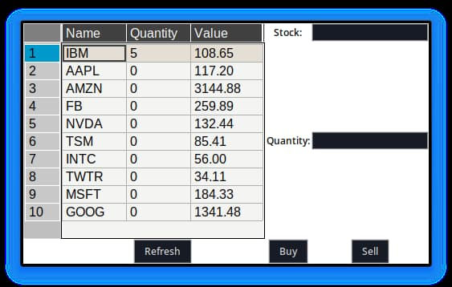

<div align = "center">

<h1><a href="https://2kabhishek.github.io/stock-trader">stock-trader</a></h1>

<a href="https://github.com/2KAbhishek/stock-trader/blob/main/LICENSE">
 </a>

<a href="https://github.com/2KAbhishek/stock-trader/pulse">
 </a>

<a href="https://github.com/2KAbhishek/stock-trader/stargazers">
</a>

<a href="https://github.com/2KAbhishek/stock-trader/network/members">
 </a>

<a href="https://github.com/2KAbhishek/stock-trader/watchers">
 </a>

<a href="https://github.com/2KAbhishek/stock-trader/graphs/contributors">
 </a>

<a href="https://github.com/2KAbhishek?tab=followers">
 </a>

<h3>Trade Stocks with CRUD 💹📊</h3>

<figure>
  
  <br/>
  <figcaption>stock-trader screenshot</figcaption>
</figure>

</div>

## What is this

stock-trader is a GUI app that lets you fictionally trade real stocks.

## Inspiration

Wanted to explore `tkinter` and `yfinance`

## Prerequisites

Before you begin, ensure you have met the following requirements:

- You have installed the latest version of `python`, `tkinter`, `yfinance` and `pandastable`.

## Getting stock-trader

To install stock-trader, follow these steps:

```bash
git clone https://github.com/2kabhishek/stock-trader
cd stock-trader
pip install -r requirements.txt
python src/stock-trader.py
```

## How it was built

stock-trader was built using `VS Code` and `python`.

## Challenges faced

While building stock-trader the main challenges were `<issue/difficulty>`

## What I learned

- Learned about `yfinance`
- Explored `tkinter`
- Used `pandastable` to manage stock data

Hit the ⭐ button if you found this useful.

## More Info

<div align="center">

<a href="https://github.com/2KAbhishek/stock-trader">Source</a> | <a href="https://2kabhishek.github.io/stock-trader">Website</a>

</div>
